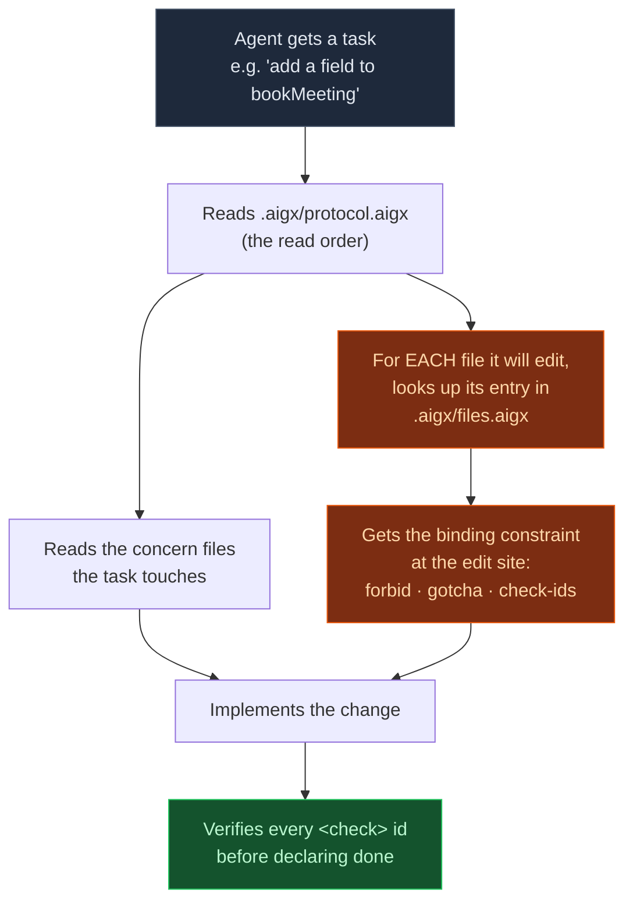

<p align="center">
  
</p>

<p align="center">
  <strong>The open, benchmark-validated context format for AI coding agents.</strong><br/>
  A <code>.aigx/</code> genome describes how your repo works — rules, per-file boundaries, gotchas —
  so any AI agent inherits your conventions and behaves like a senior engineer who already knows the code.
</p>

<p align="center">
  <a href="LICENSE"></a>
  <a href="standard/LICENSE"></a>
  <a href="https://www.npmjs.com/package/@aigx/cli"></a>
  <a href="https://pypi.org/project/aigx/"></a>
  <a href="https://crates.io/crates/aigx"></a>
  <a href="standard/AIGX-1.1.md"></a>
  <a href="BENCHMARK.md"></a>
</p>

<p align="center">
  <a href="#-quick-start">Quick start</a> ·
  <a href="#-install-the-toolchain">Install</a> ·
  <a href="#-the-proof">The proof</a> ·
  <a href="#-using-aigx-with-your-stack">Use it with your stack</a> ·
  <a href="standard/AIGX-1.1.md">Spec</a> ·
  <a href="docs/aigx-in-60-seconds.md">60-second intro</a>
</p>

---

**AIGX (AI Genome Exchange)** stores a codebase's AI-agent rules in a centralized `.aigx/` directory with a
per-file **boundary index** — and injects **nothing** into your source code. To our knowledge it is **the
only context format ever validated in a controlled benchmark**, where it was the **only format to rank
first on *both* a weaker and a stronger model** (Claude Haiku 4.5 *and* Sonnet 4.6, n=60) while surviving
**~24 deliberate attempts to beat it.**

> **Straight about the statistics (up front):** at n=60 the *top* formats are a **statistical tie** on the
> composite mean — AIGX is not a blowout. Its defensible edge is being the **most consistent across models,
> the most robust under challenge, the simplest to author, and the only option measured at all.**
> [Full scope, limitations & critique responses →](docs/limitations.md)

<sub>Spec **v1.1** (CC-BY-4.0) · Tools **MIT** · Tool-agnostic · Published on npm · PyPI · crates.io · Last updated 2026-06-20</sub>

---

## 🚀 Quick start

One command scaffolds a genome **and** wires up your AI agent(s):

```bash
npm create aigx
# or: npx create-aigx   (same thing)
```

It's interactive — pick Cursor / Claude Code / Copilot / Windsurf / Aider / `AGENTS.md`, choose CI, done:

```text
your-repo/
├── .aigx/
│   ├── protocol.aigx        ← the read protocol every agent loads first
│   ├── product.aigx         ← product context + freshness clause
│   ├── architecture.aigx    ← per-concern rules  (ARCH-* ids)
│   ├── engineering.aigx     ← hard-correctness invariants (ENG-* ids)
│   ├── files.aigx           ← ★ the per-file boundary index — fill this in
│   └── agent.aigx           ← self-maintenance rules for agents
├── .cursor/rules/aigx.mdc · CLAUDE.md · AGENTS.md · .windsurfrules · .aider.conf.yml
└── .github/{copilot-instructions.md, workflows/aigx-validate.yml}
```

Your source code is untouched. Then fill in **three things** — `files.aigx` (the keystone), your rules in
`architecture.aigx`, and `product.aigx` — and validate with `aigx lint`. The
[60-second intro](docs/aigx-in-60-seconds.md) and [authoring guide](docs/authoring-guide.md) walk you
through it; a complete real-world genome is in [`examples/sourcing-app/`](examples/sourcing-app/).

---

## 📦 Install the toolchain

AIGX ships **three independent reference implementations** (Node, Python, Rust) — install from whatever
registry you already live in. They're held in lock-step by a [conformance suite](tests/conformance/).

| You want… | Install | Gives you |
|---|---|---|
| **Scaffold a genome** | `npm create aigx` | the interactive scaffolder ([create-aigx](https://www.npmjs.com/package/create-aigx)) |
| **The CLI** (Node) | `npm i -g @aigx/cli` | the `aigx` command ([@aigx/cli](https://www.npmjs.com/package/@aigx/cli)) |
| **The CLI / validator** (Python) | `pip install aigx` | `aigx` + `aigx-lint` ([PyPI](https://pypi.org/project/aigx/)) |
| **The CLI / validator** (Rust) | `cargo install aigx` | the `aigx` binary ([crates.io](https://crates.io/crates/aigx)) |
| **Editor support** | VS Code Marketplace → **AIGX Language Support** | highlighting, hover, diagnostics, go-to-def ([editors/vscode](editors/vscode/)) |
| **Libraries** (Node) | `npm i @aigx/parser @aigx/lint` | programmatic parse + validate |

```bash
# zero-install runs, too:
npx @aigx/cli lint
npx @aigx/cli resolve src/features/auth/login.ts
```

> **Naming note:** npm reserves the bare `aigx` name, so the npm CLI is **`@aigx/cli`** — but the installed
> **command is `aigx`** everywhere. On PyPI and crates.io the package is plain `aigx`.

---

## 🔬 The proof

We built a controlled benchmark: one real TypeScript codebase with planted traps (deep-import violations,
dependency cycles, cross-tenant leaks, cache-ordering bugs, hallucination — 10 hard pitfalls), held
**constant**, with **only the context format varying** and **semantic parity machine-enforced** (every
format carries the identical rules). The subject is an autonomous agent that greps, edits, and runs tests.
Scoring is deterministic and tamper-proof.

| Format | Sonnet 4.6 mean | pass@1 | hidden | Haiku 4.5 mean | pass@1 | hidden |
|---|:---:|:---:|:---:|:---:|:---:|:---:|
| **🧬 AIGX** | **95.4** | **0.92** | **98.6%** | **93.5** | **0.78** | **96.0%** |
| Markdown | 95.1 | 0.80 | 96.4% | 92.2 | 0.70 | 93.6% |
| XML | 93.1 | 0.80 | 93.8% | 92.3 | 0.75 | 93.3% |
| In-source headers | 94.6 | 0.80 | 96.1% | 92.4 | 0.67 | 90.2% |

AIGX ranks first on mean, pass@1, *and* hidden-test pass on **both** models — **but the honest story is
consistency, not margin.** Markdown is great on Sonnet yet near-last on Haiku; XML is the rough reverse.
**AIGX is the only format first on both tiers** — and it survived **~24 challenger variants across 6
research rounds**, every one of which failed to beat it.

🔬 Full method, models, sample sizes, raw data, and the challenger log → **[BENCHMARK.md](BENCHMARK.md)** ·
honest caveats → **[docs/limitations.md](docs/limitations.md)**

---

## 🛠 Using AIGX with your stack

### 1 · Scaffold (interactive)

```bash
npm create aigx           # pick your agent(s) + CI, then fill in files.aigx
npm create aigx -- --yes  # non-interactive: scaffold everything (great for CI)
```

### 2 · The `aigx` CLI

Same six commands whether you installed via npm, pip, or cargo:

```bash
aigx init                 # scaffold a .aigx/ genome (also interactive)
aigx lint                 # validate: required files, resolving checks, no stale paths, no dup ids
aigx resolve <path>       # O(1) — print one file's boundary (role · forbid · gotcha · checks)
aigx doctor               # environment + genome health check
aigx format [--check]     # parity-safe whitespace normalization
aigx check-conformance    # report your genome's conformance level (G1–G4 + recommended)
```

```text
$ aigx resolve src/features/meetings/bookMeeting.ts
Applicable genome: .aigx
Role:   Book a meeting (validate slot + contact)
Forbid: NEVER import @/features/suppliers/internal/*   [CRIT]
Gotcha: get contact_email from the suppliers PUBLIC api, never the internal mapper
Checks: ARCH-no-deep-imports, DATA-integer-cents, TEST-failing-first
```

### 3 · Validate in CI

The genome can't silently rot — wire the validator into CI so a moved/renamed file fails the build:

```yaml
# .github/workflows/aigx-validate.yml
- run: npx --yes @aigx/cli lint        # or: pipx run aigx --root .  ·  or: cargo run -p aigx -- lint
```

### 4 · Editor support — `.aigx` highlights everywhere

| Editor | How |
|---|---|
| **VS Code / Cursor / Windsurf** | Install **[AIGX Language Support](editors/vscode/)** — highlighting, file icons, snippets, **rule-id autocomplete**, **hover** on rule ids, **go-to-definition**, inline **diagnostics**, format, and **AIGX: Resolve current file's boundary** |
| **GitHub** | `.aigx` already renders (via [`.gitattributes`](.gitattributes)); a [Linguist PR kit](editors/linguist/) is ready for first-class support |
| **Sublime Text · TextMate · Zed** | Ready-made configs in [`editors/`](editors/) — all from one canonical [TextMate grammar](editors/textmate/) (`source.aigx`) |

### 5 · Programmatic (build on AIGX)

```bash
npm i @aigx/parser @aigx/lint
```

```js
import { parseGenome } from '@aigx/parser'
import { lint } from '@aigx/lint'

const model = parseGenome('.')          // → canonical JSON data model (matches the spec's schema)
const { ok, errors } = lint('.')        // → the same checks as the CLI / aigx-lint
```

Python (`pip install aigx`) exposes the validator as `aigx-lint` and as `import aigx_lint`. For MCP clients
and codebase-memory agents, resolve a boundary as JSON before graph/search context — see
[JIT Context Hydration](docs/jit-hydration.md).

### 6 · Wire any agent

`npm create aigx` configures these for you; or copy one file from [`integrations/`](integrations/):

| Cursor | Claude Code | GitHub Copilot | Windsurf | Aider | Generic |
|---|---|---|---|---|---|
| `.cursor/rules/aigx.mdc` | `CLAUDE.md` | `.github/copilot-instructions.md` | `.windsurfrules` | `.aider.conf.yml` | `AGENTS.md` |

For a custom agent, paste the one-paragraph addendum from [the spec §12.3](standard/AIGX-1.1.md#123-the-agent-addendum).

---

## 🧬 How it works



The magic is **per-file addressability**. Agentic models read selectively — they grep, open the file
they're editing, and rarely re-scan a whole rule doc. AIGX makes the binding constraint for *that file*
retrievable in one lookup (`files.aigx`), instead of buried in prose — *and* keeps it out of your source.
We tested all three placements (global prose, inline-in-source, addressed index); **the addressed index
won, inlining lost.** ([the principles →](docs/principles.md))

### Anatomy of a genome

```xml
<!-- .aigx/architecture.aigx — rules with stable, citable ids -->
<aigx-architecture>
  <rule id="ARCH-no-deep-imports">Import features only through their public barrel. Deep imports are forbidden.</rule>
</aigx-architecture>

<!-- .aigx/files.aigx — THE KEYSTONE: the binding constraint per edited file -->
<aigx-files>
  <file path="src/features/auth/login.ts" domain="auth">
    <role>Handle login — validate credentials, issue a session</role>
    <forbid pri="CRIT">NEVER import @/features/billing/internal/*</forbid>
    <gotcha>token expiry is checked at read-time, not issue-time</gotcha>
    <check>ARCH-no-deep-imports ENG-tenant-scope</check>
  </file>
</aigx-files>
```

| Biology | AIGX |
|---|---|
| **Genome** — the code that builds & runs an organism | `.aigx/` — the context that runs an agent in your codebase |
| **Genes** with stable names | `<rule id="ARCH-2">` — rules with stable, citable ids |
| **Gene expression per tissue** | `files.aigx` — which rules are "expressed" at each file |
| **Sequencing / exchange** | a portable, readable record any agent can inherit |

---

## 📖 The standard

AIGX is a real, citable standard — not just a convention:

- **[standard/AIGX-1.1.md](standard/AIGX-1.1.md)** — the normative spec (20 sections, RFC 2119 language)
- **[AIGX-1.1.abnf](standard/AIGX-1.1.abnf)** — formal grammar (RFC 5234) · **[AIGX-1.1.schema.json](standard/AIGX-1.1.schema.json)** — canonical JSON data model
- **[media-type-registration.md](standard/media-type-registration.md)** — IANA template for `application/aigx`
- **[conformance](standard/conformance.md) · [security](standard/security-considerations.md) · [interoperability](standard/interoperability.md) · [change-control](standard/change-control.md)**

Dual-licensed: **spec text CC-BY-4.0**, **reference tools MIT** — so anyone can reimplement AIGX in any
language, freely. (`SPEC.md` is the informal, example-led companion.)

---

## How AIGX compares

| | **AIGX** | AGENTS.md / CLAUDE.md | Cursor `.mdc` | `llms.txt` |
|---|:---:|:---:|:---:|:---:|
| Per-file boundary targeting | ✅ **explicit index** | path globs (coarse) | glob-scoped | ❌ |
| Forbidden-import / gotcha per file | ✅ | ⚠️ prose only | ⚠️ | ❌ |
| Zero source-code injection | ✅ | ✅ | ✅ | ✅ |
| Tool-agnostic | ✅ | ⚠️ varies | ❌ Cursor-only | ✅ |
| **Benchmark-validated** | ✅ | ❌ | ❌ | ❌ |

AIGX isn't out to replace `AGENTS.md` — it's the **genome layer**: a richer, *measured*, per-file-precise
substrate you author once and can export down to a flat `AGENTS.md`/`CLAUDE.md` when a tool needs it.

---

## FAQ

**What is AIGX in one sentence?** An open context format that stores a codebase's AI-agent rules in a
centralized `.aigx/` directory with a per-file boundary index — the only such format validated to win a
controlled benchmark.

**How is it different from AGENTS.md / CLAUDE.md?** Those are usually one flat prose file. AIGX adds a
**per-file boundary index** so an agent gets the binding constraint *at the edit site*, and it's
tool-agnostic and exports down to those formats.

**Does it put comments in my source code?** No — deliberately. We measured that in-source headers *hurt* a
strong model. The genome lives entirely in `.aigx/`; your diffs stay clean.

**Is it really better, or are the top formats close?** Honestly, at matched power the top formats are a
tight cluster. AIGX's edge is **robustness, cross-model generalization, and simplicity** — and being the
one design that survived every challenger.

**Can I use it commercially / build tools on it?** Yes — tools are MIT, the spec is CC-BY-4.0. No permission
needed.

---

## Ecosystem

| Package | Registry | Install |
|---|---|---|
| [`@aigx/cli`](https://www.npmjs.com/package/@aigx/cli) | npm | `npm i -g @aigx/cli` → `aigx` |
| [`create-aigx`](https://www.npmjs.com/package/create-aigx) | npm | `npm create aigx` |
| [`@aigx/parser`](https://www.npmjs.com/package/@aigx/parser) · [`@aigx/lint`](https://www.npmjs.com/package/@aigx/lint) | npm | `npm i @aigx/parser @aigx/lint` |
| [`aigx`](https://pypi.org/project/aigx/) | PyPI | `pip install aigx` |
| [`aigx`](https://crates.io/crates/aigx) | crates.io | `cargo install aigx` |
| **AIGX Language Support** | VS Code | Marketplace → *AIGX Language Support* |

Plus zero-dep tools in [`tools/`](tools/): `aigx-lint` (validator/resolver), `aigx-sync` (rename pre-commit
hook), `aigx-mcp` (stdio MCP bridge), `aigx-export` (safe `.aigx`/Markdown serializer).

<details>
<summary><strong>Repository layout</strong></summary>

```text
aigx/
├── standard/        ← the NORMATIVE standard (spec, ABNF, JSON schema, IANA, conformance…)
├── SPEC.md          ← informal, example-led spec (points to standard/)
├── packages/        ← npm workspace: @aigx/cli, @aigx/parser, @aigx/lint
├── bin/create-aigx.mjs · pyproject.toml · crates/aigx/   ← npm / PyPI / Cargo entry points
├── editors/         ← VS Code ext, TextMate grammar, Sublime, Zed, Linguist kit
├── tools/           ← aigx-lint, aigx-sync, aigx-mcp, aigx-export (zero-dep)
├── tests/conformance/  ← cross-validator suite (Python · Node · Rust agree)
├── integrations/    ← Cursor, Claude Code, Copilot, Windsurf, Aider, AGENTS.md, CI
├── examples/        ← sourcing-app (full), minimal
├── docs/            ← 60-seconds, authoring guide, principles, limitations, migration, jit-hydration
├── .aigx/           ← this repo's own genome (AIGX uses AIGX)
└── RELEASING.md     ← how each package is published
```
</details>

---

## Status

- ✅ **Spec v1.1** — stable; normative standard with ABNF, JSON schema & IANA media type
- ✅ **Published** — npm (`@aigx/cli`, `create-aigx`, `@aigx/parser`, `@aigx/lint`) · PyPI (`aigx`) · crates.io (`aigx`)
- ✅ **3 reference validators** (Node · Python · Rust) agreeing on a conformance suite
- ✅ **Editor support** — VS Code extension + one canonical grammar reused across Sublime/TextMate/Zed/Linguist + GitHub highlighting
- ✅ **Benchmark** — n=60 on two models, reproducible, honest
- 🔜 VS Code Marketplace + Open VSX listing · Language Server (LSP) · monorepo-scale benchmark · Python/Go examples

Want to help? [CONTRIBUTING.md](CONTRIBUTING.md) · [open an issue](https://github.com/Lolner95/AIGX/issues) · star the repo.

---

## Citation

```bibtex
@software{aigx2026,
  title   = {AIGX: AI Genome Exchange — A Benchmark-Validated Context Format for AI Coding Agents},
  author  = {Parisotto, Grégory},
  year    = {2026},
  url     = {https://github.com/Lolner95/AIGX},
  license = {MIT (tools), CC-BY-4.0 (spec)}
}
```

## License

Reference **tools**: [MIT](LICENSE). Specification **text**: [CC-BY-4.0](standard/LICENSE). Open spec +
permissive tools, so AIGX can be adopted and reimplemented by anyone, for anything.

<p align="center"><sub>Built from a research-grade benchmark. The genome of your codebase, for the age of AI agents. 🧬</sub></p>
