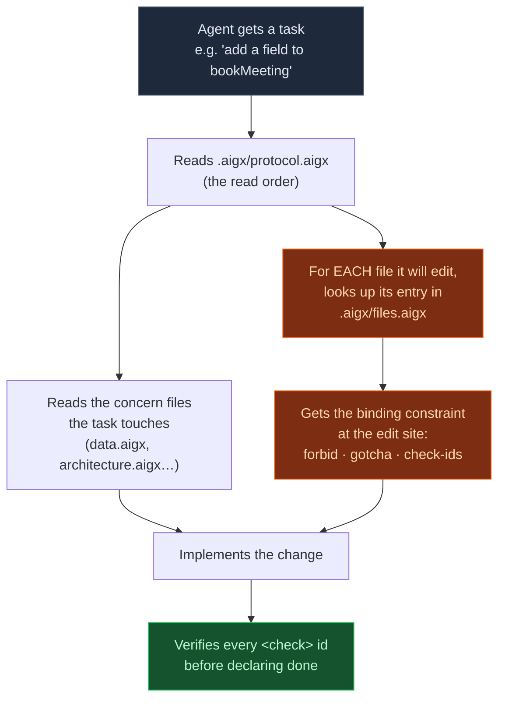

<div align="center">


# AIGX - AI Genome Exchange

**The open, benchmark-validated context format for AI coding agents.**

[](LICENSE)
[](SPEC.md)
[](BENCHMARK.md)
[](#status--roadmap)
[](CONTRIBUTING.md)

</div>

---

**AIGX (AI Genome Exchange) is an open context format that stores a codebase's AI-agent rules in a
centralized `.aigx/` directory with a per-file *boundary index*, while injecting nothing into your source
code.** To our knowledge it is **the only context format ever validated in a controlled benchmark** - and
in that benchmark it was the **only format that ranked first on *both* a weaker and a stronger model**
(Claude Haiku 4.5 *and* Sonnet 4.6, n=60), while surviving **~24 deliberate attempts to beat it.**

> **Straight about the statistics (up front, not in a footnote):** at n=60 the *top* formats are a
> **statistical tie** on the composite mean - AIGX is not a blowout over good alternatives. Its real,
> defensible edge is being the **most consistent across models, the most robust under challenge, the
> simplest to author, and the only option that was measured at all.** A reproducible tie-at-the-top you can
> write in an afternoon and that holds across model tiers beats a fragile, format-specific spike.
> [Full scope, limitations & responses to critique →](docs/limitations.md)

> **The one-liner:** A *genome* is the context that builds and operates an organism. **AIGX is the genome
> of your codebase** - a portable, standard description of your rules, boundaries, and conventions that
> *any* AI agent can read to inherit how your project works. Hand an agent your genome and it behaves
> like a senior engineer who already knows the code.

<sub>Spec v1.1 · MIT licensed · Tool-agnostic · Last updated 2026-06-15</sub>

---

## Why AIGX exists

AI coding agents are only as good as the context you give them - and today that context is a mess:

- **It's a wall of prose.** `CLAUDE.md` / `AGENTS.md` files grow into thousand-line documents. Agents
  read *selectively*, grepping at the edit site - so the one rule that mattered for *this* file is buried
  three scrolls away and never read.
- **It's not targeted.** "Don't do deep imports" is a global rule. But *which* files have a forbidden
  import, and *what* is the sanctioned path instead? Flat rule docs can't say.
- **It pollutes your code.** The other way to localize context - inline `// @ai: never import X` comments
  - clutters every diff and, we measured, actually *hurts* a strong model by adding parse-noise.
- **Nobody knows if any of it works.** Every existing format is justified by assertion ("use X for Y"),
  never by evidence that it changes what the model produces.

AIGX fixes all four - and we **measured** that it does.

---

## The proof (lead with it, because nobody else has it)

We built a controlled benchmark: one real TypeScript codebase with planted traps (deep-import
violations, dependency cycles, cross-tenant data leaks, cache-ordering bugs, AI hallucination, 10
hard-correctness pitfalls), held **constant**, with **only the context format varying** and **semantic
parity machine-enforced** (every format carries the identical rules). The subject is an autonomous agent
that greps, edits, and runs tests. Scoring is deterministic and tamper-proof.

**Result - authoritative, powered to n=60:**

| Format | Sonnet 4.6 mean | pass@1 | hidden | Haiku 4.5 mean | pass@1 | hidden |
|---|:---:|:---:|:---:|:---:|:---:|:---:|
| **🧬 AIGX** | **95.4** | **0.92** | **98.6%** | **93.5** | **0.78** | **96.0%** |
| Markdown | 95.1 | 0.80 | 96.4% | 92.2 | 0.70 | 93.6% |
| XML | 93.1 | 0.80 | 93.8% | 92.3 | 0.75 | 93.3% |
| In-source headers | 94.6 | 0.80 | 96.1% | 92.4 | 0.67 | 90.2% |

AIGX ranks nominally first on mean, pass@1, *and* hidden-test pass on both models - **but the honest
story is consistency, not margin.** Look down the columns: Markdown is excellent on Sonnet (95.1) yet
near-last on Haiku (92.2); XML is the rough reverse. **AIGX is the only format that is first on *both*
tiers** - the one you can trust not to fall over when you change models. And it survived a deliberate
campaign to dethrone it: **~24 challenger variants across 6 research rounds** (in-source guards, positional
tricks, salience tiers, prose re-renderings, and combinations) - **every one failed.**

🔬 **Full method, models, sample sizes, raw data, and the challenger log:** **[BENCHMARK.md](BENCHMARK.md)**.

> **The statistics, stated plainly:** at n=60 the *top* formats are a **statistical tie** on the composite
> mean - this is *not* a blowout, and we don't pretend otherwise. AIGX's defensible wins are **cross-model
> consistency** (first on both tiers), **robustness** (beat every challenger), **simplicity**, and being
> **the only format measured at all**. n=30 rankings are noise; AIGX is the one that still holds at n=60.
> [Full honesty: scope, limitations & responses to every critique →](docs/limitations.md)

---

## How AIGX compares

| | **AIGX** | AGENTS.md / CLAUDE.md | Cursor `.mdc` rules | `llms.txt` |
|---|:---:|:---:|:---:|:---:|
| Scope | **codebase rules** | codebase rules | codebase rules | docs index |
| Per-file boundary targeting | ✅ **explicit index** | path globs (coarse) | glob-scoped | ❌ |
| Forbidden-import / gotcha per file | ✅ | ⚠️ prose only | ⚠️ | ❌ |
| Zero source-code injection | ✅ | ✅ | ✅ | ✅ |
| Tool-agnostic (not one vendor) | ✅ | ⚠️ varies | ❌ Cursor-only | ✅ |
| **Empirically benchmark-validated** | ✅ **yes** | ❌ | ❌ | ❌ |

AIGX isn't out to replace `AGENTS.md` - those are great and widely supported. AIGX is the **genome
layer**: a richer, *measured*, per-file-precise substrate you author once and can export down to a flat
`AGENTS.md`/`CLAUDE.md` when a tool needs it. Adopt the substrate, not the vendor.

---

## Quick start (under 60 seconds)

1. Copy the starter genome into your repo:
   ```bash
   # from your project root
   cp -r path/to/aigx/templates/starter/.aigx .aigx
   ```
2. You now have:
   ```text
   your-repo/
   ├── .aigx/
   │   ├── protocol.aigx        # how an agent should read this genome (read-first)
   │   ├── product.aigx         # what the product is + which docs are stale
   │   ├── architecture.aigx    # one file per concern: rules as <rule id="…">
   │   ├── data.aigx
   │   ├── …
   │   └── files.aigx           # ★ the per-file boundary index - the keystone
   └── src/…                    # your code - left completely untouched
   ```
3. Fill in `files.aigx` - for each file an agent will touch, state its boundary:
   ```xml
   <file path="src/features/meetings/bookMeeting.ts" domain="meetings">
     <role>Book a meeting (validate slot + contact)</role>
     <forbid pri="CRIT">NEVER import @/features/suppliers/internal/* (deep import = ARCH-2)</forbid>
     <gotcha pri="CRIT">get contact_email from the suppliers PUBLIC api, never the internal mapper</gotcha>
     <check>ARCH-2 ARCH-4 DATA-2 TEST-1</check>
   </file>
   ```
4. Point your agent at it. Add one line to your existing `AGENTS.md` / `CLAUDE.md` / system prompt:
   > *This repo uses AIGX. Read `.aigx/protocol.aigx` first; for each file you edit, read its `<file>`
   > entry in `.aigx/files.aigx` and obey its `<forbid>` and `<check>`.*

That's it. A complete, real-world genome is in **[`examples/sourcing-app/`](examples/sourcing-app/)**.

---

## How it works



The magic is **per-file addressability**. Agentic models read selectively - they grep, open the file
they're editing, and rarely re-scan the whole rule doc. AIGX makes the binding constraint for *that file*
retrievable in one lookup (in `files.aigx`), instead of buried in a wall of prose - *and* keeps it out of
your source code. We tested all three placements (global prose, inline-in-source, and the addressed
index); **the addressed index won, inlining lost.** It's not about document position or repetition - it's
about targeting the rule to the file. (See [the principles](docs/principles.md#l2--per-file-addressability-beats-both-global-prose-and-in-source-inlining).)

---

## The genome metaphor (and why it's more than a metaphor)

| Biology | AIGX |
|---|---|
| **Genome** - the code that builds & runs an organism | `.aigx/` - the context that runs an agent in your codebase |
| **Genes** with stable names | `<rule id="ARCH-2">` - rules with stable, citable ids |
| **Gene expression per tissue** - which genes are active where | `files.aigx` - which rules/forbids/gotchas are "expressed" at each file |
| **Regulatory context per cell type** | `<domain>.aigx` cards - per-feature context |
| **Exchange / sequencing** - a portable, readable record | a portable format any agent reads to inherit your conventions |

A genome doesn't live *inside* every cell's job description - it's a central library the cell consults.
AIGX is the same: the rules live in `.aigx/`, your code stays clean, and the per-file index is the
expression map that says *which rules apply right here.*

---

## Anatomy of a genome

A complete genome (see the [full worked example](examples/sourcing-app/)) has four parts:

**1. The read protocol** - `protocol.aigx`. One screen. Tells the agent: read the index entry for each
file you edit, obey its forbid, verify its checks, schema-first/test-first/minimal-blast.

**2. Per-concern rule files** - `architecture.aigx`, `data.aigx`, `auth.aigx`, … Each is the full rule
text as `<rule id="…">` tags. Ids are namespaced (`ARCH-*`, `DATA-*`, `ENG-*`) and are the cross-reference
backbone.

**3. The per-file boundary index** - `files.aigx`. **The keystone.** One entry per file an agent might
edit: its `role`, its `forbid` (only for real import boundaries - keep these *rare*), its single most
important `gotcha`, and the `check` rule-ids to verify. This is what no other format has.

**4. Per-domain cards** - `<domain>.aigx` colocated with each feature folder: purpose, public API, test
policy, blast radius, and rule-tagged facts.

📖 The normative format definition is in **[SPEC.md](SPEC.md)**.

---

## Why it works - the design principles

Seven findings, each backed by the benchmark ([deep dive](docs/principles.md)):

1. **Short, scarce, direct wins.** Lengthening, diluting, or re-framing a signal *reduces* compliance.
2. **Locality beats position.** *Where in the codebase* a rule lives (at the edit site) matters; *where in
   the document* it lives does not.
3. **Simpler wins.** Every embellishment we added washed out or hurt. Complexity bears the burden of proof.
4. **`n=30` rankings are noise.** Four times a "winner" with a perfect headline metric collapsed at n=60.
5. **Winning levers don't stack.** Combining two good ideas produced *less* than either alone.
6. **Format effects are model-dependent and don't shrink with capability.** A better model does *not* make
   context format less important - the effect *grew* from Haiku to Sonnet.
7. **The residual is model capability, not format.** Past a point, you can't fix hard tasks with better docs.

---

## Tool support

AIGX is plain text in a `.aigx/` directory, so **any** agent can use it today via one prompt line (see
Quick Start). It's designed to be **tool-agnostic** and to *layer on top of* whatever you already use:

| Agent / tool | How to use AIGX today |
|---|---|
| Claude Code | Reference `.aigx/` from your `CLAUDE.md` (one line) |
| Cursor | Reference `.aigx/` from a `.cursor/rules` rule |
| GitHub Copilot | Reference `.aigx/` from `.github/copilot-instructions.md` |
| Aider | Add `.aigx/protocol.aigx` to read-only context |
| Any LLM / custom agent | Paste the addendum from [the spec](SPEC.md#agent-addendum) |

> Ships today: **[`aigx-lint`](tools/aigx-lint/)** - validate a genome against your repo in CI (so it
> can't silently rot) and resolve any file's boundary in O(1) (so it scales to monorepos). Exporters to
> `AGENTS.md`/`CLAUDE.md`/`.mdc` are on the [roadmap](#status--roadmap).

---

## FAQ

**What is AIGX in one sentence?**
AIGX (AI Genome Exchange) is an open, MIT-licensed context format that stores a codebase's AI-agent rules
in a centralized `.aigx/` directory with a per-file boundary index, and is the only such format validated
to win a controlled benchmark.

**How is AIGX different from AGENTS.md or CLAUDE.md?**
Those are (usually) a single flat prose file. AIGX adds a **per-file boundary index** - for each source
file, the exact rules, forbidden imports, and gotchas that apply *there* - so an agent gets the binding
constraint at the edit site instead of scrolling a long doc. AIGX is also tool-agnostic and exports down
to those formats. Think of AIGX as the richer substrate; `AGENTS.md` as one possible output of it.

**Does it work with Cursor, Claude Code, Copilot, Aider?**
Yes. It's plain text; you point any agent at `.aigx/` with one instruction line. See [Tool support](#tool-support).

**Does AIGX put comments in my source code?**
No - and that's deliberate. We measured that in-source headers/comments *hurt* a strong model. The genome
lives entirely in `.aigx/`; your code and your diffs stay clean.

**What exactly does the benchmark prove?**
That with the rules held identical and only the *format* changing, AIGX produced the most correct and most
disciplined agent output - #1 on mean, pass@1, and hidden-test pass on both Claude Haiku 4.5 and Sonnet
4.6 at n=60 - and that this held up when we tried hard to beat it. [Full methodology →](BENCHMARK.md)

**Is it really better, or are the top formats close?**
Honestly: at matched power the top formats are a tight cluster. AIGX's edge is **robustness, cross-model
generalization, and simplicity** - it wins on every metric on both models and is the design that survived
every challenger. That's a more useful result than a fragile blowout.

**Why "genome"?**
A genome is the context that builds and operates an organism - central, portable, and consulted rather
than copied into every cell. AIGX is that for your codebase: the central, portable description of how your
project works that any agent reads to inherit your conventions.

**Can I use it commercially / change it / build tools on it?**
Yes - it's MIT. Use it, fork it, build products on it, no permission needed.

---

## Repository layout

```text
aigx/
├── README.md            ← you are here
├── SPEC.md              ← the normative format specification (v1.1)
├── BENCHMARK.md         ← full method, results, raw data, challenger log
├── CHANGELOG.md         ← version history
├── CONTRIBUTING.md      ← how to contribute
├── CITATION.cff         ← citation metadata
├── LICENSE              ← MIT
├── llms.txt             ← machine-readable index for AI answer engines
├── docs/
│   ├── concept.md       ← the genome philosophy, in depth
│   ├── authoring-guide.md
│   ├── migration.md     ← how to adopt AIGX alongside an existing AGENTS.md / CLAUDE.md
│   ├── principles.md    ← the 7 benchmark-backed laws
│   ├── limitations.md   ← scope, honest caveats & point-by-point responses to critique
│   ├── glossary.md      ← terms and definitions
│   ├── roadmap.md       ← planned work: exporters, VS Code ext, more examples, MCP
│   └── faq.md
├── examples/
│   ├── sourcing-app/    ← a complete, real-world genome (.aigx/ + domain cards)
│   └── minimal/         ← the smallest valid genome (3 files, 1 rule, 1 entry)
├── templates/
│   └── starter/.aigx/   ← copy this into your repo to begin
└── tools/
    └── aigx-lint/       ← zero-dep validator + per-file resolver (CI-ready)
```

---

## Status & roadmap

- ✅ **Spec v1.1** - stable, normative; includes hierarchical/monorepo scaling ([SPEC.md](SPEC.md)).
- ✅ **Benchmark** - n=60 on two models, reproducible, with honest [scope & limitations](docs/limitations.md).
- ✅ **`aigx-lint`** - validate a genome against the repo (missing paths, dangling check-ids) + O(1)
  per-file resolution. Zero-dependency. ([tools/aigx-lint](tools/aigx-lint/))
- ✅ **Minimal example** - smallest valid genome for reference and tooling tests ([examples/minimal](examples/minimal/)).
- ✅ **Migration guide** - step-by-step path from a flat `AGENTS.md`/`CLAUDE.md` ([docs/migration.md](docs/migration.md)).
- 🔜 Exporters: `aigx → AGENTS.md / CLAUDE.md / .cursor/rules` - see [roadmap](docs/roadmap.md).
- 🔜 VS Code extension - hover a file → see its `.aigx` boundary.
- 🔜 Monorepo-scale benchmark (5k+ files) and more worked examples (Python, Go).

Want to help? [CONTRIBUTING.md](CONTRIBUTING.md) · [open an issue](https://github.com/Lolner95/AIGX/issues) · star the repo to follow along.

---

## Citation

If AIGX or its benchmark informs your work, please cite it (a "Cite this repository" button is on the repo
sidebar; details in [CITATION.cff](CITATION.cff)).

```bibtex
@software{aigx2026,
  title  = {AIGX: AI Genome Exchange - A Benchmark-Validated Context Format for AI Coding Agents},
  author = {Parisotto, Grégory},
  year   = {2026},
  url    = {https://github.com/Lolner95/AIGX},
  license = {MIT}
}
```

---

## License

[MIT](LICENSE) - use it, fork it, build on it, no permission needed. AIGX is meant to be a shared
standard, so it's licensed to be freely adopted by anyone, for anything.

<div align="center"><sub>Built from a research-grade benchmark. The genome of your codebase, for the age of AI agents. 🧬</sub></div>
